# Basic knowledge

## DNS

Domain name system, is like the phonebook of the internet, they are responsible of finding the IP’s of every web site.

In a typical DNS query without any caching, there are four servers that work together to deliver an IP address to the client: recursive resolvers, root nameservers, TLD nameservers, and authoritative nameservers.

First the resolver queries the root nameserver. The root server is the first step in translating (resolving) human-readable domain names into IP addresses. The root server then responds to the resolver with the address of a Top Level Domain (TLD) DNS server (such as .com or .net) that  stores the information for its domains.

Next the resolver queries the TLD server. The TLD server responds with the IP address of the domain’s authoritative nameserver. The recursor then queries the authoritative nameserver, which will respond with the IP address of the origin server.

The resolver will finally pass the origin server IP address back to the client. Using this IP address, the client can then initiate a query directly to the origin server, and the origin server will respond by sending website data that can be interpreted and displayed by the web browser.

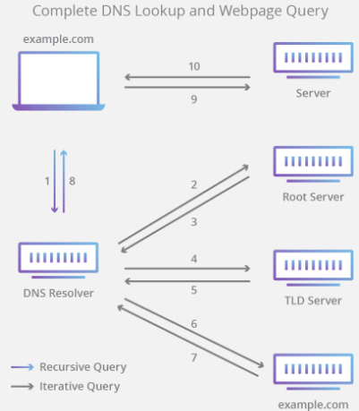

## HTTP

Hyper text transfer protocol, basically it’s a protocol to connect between clients and servers, where the client sends a request, and the server returns a response to that request.

Methods for HTTP are: POST – GET – PUT – PATCH – DELETE
POST → Is a rquest to the web server to accept the data enclosed in the body of the request. Used more likely to store some new data.

GET → Is used to read data from the URL.

PUT → used to update or create new data, where the resource ID is chosen by the client and not the server.

DELETE → Used to delete a resource.

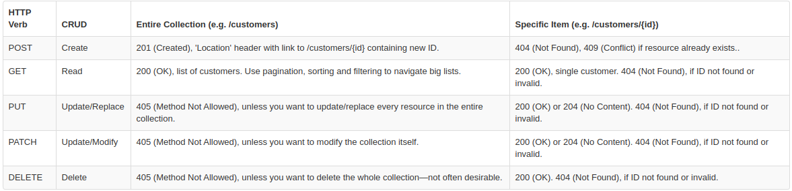
        
## CORS

A request for a resource (like an image or a font) outside of the origin is known as a cross-origin request. CORS (cross-origin resource sharing) manages cross-origin requests.

Allowing cross-origin requests is helpful, as many websites today load resources from different places on the Internet (stylesheets, scripts, images, and more).

## RESTful

A RESTful API is an architectural style for an application program interface (API) that uses HTTP requests to access and use data. That data can be used to GET, PUT, POST and DELETE data types, which refers to the reading, updating, creating and deleting of operations concerning resources.

REST technology is generally preferred over other similar technologies. This tends to be the case because REST uses less bandwidth, making it more suitable for efficient internet usage. RESTful APIs can also be built with programming languages such as JavaScript or Python.

Example → https://official-joke-api.appspot.com/jokes/programming/random

This API REST will return you in JSON format, a random joke.
    
## Middlewares (On NodeJS)

It’s the code that runs between the request from the client, until it reaches the server.

A perfect example is when you need to allow a user to have access to a determinate URL, and if he’s not logged in, it will return you to a different URL than the requested one.

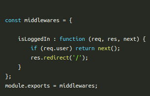

## NPM, NVM and YARN

NPM → is the package manager for the node JavaScript platform. It puts modules in place so node can find them.

NVM → Is a tool that allows you to install nodejs and have different version of it.

YARN → is a package manager for your code. It allows you to share your code to another developers around the world.

## JSON

JavaScript Object Notation → When exchanging data with the server, the data can only be text, and JSON is text, and we can convert every JavaScript object into JSON and send it to the server.

Sending Data →

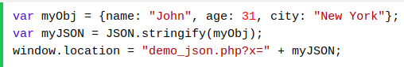

Recieving data → 

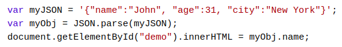

JSON is a lightweight data-interchange format
JSON is "self-describing" and easy to understand
JSON is language independent *

## JWT

defines a compact and self-contained way for securely transmitting information between parties as a JSON object. 

When should we use them?

    • Authorization: This is the most common scenario for using JWT. Once the user is logged in, each subsequent request will include the JWT, allowing the user to access routes, services, and resources that are permitted with that token. Single Sign On is a feature that widely uses JWT nowadays, because of its small overhead and its ability to be easily used across different domains.
      
    • Information Exchange: JSON Web Tokens are a good way of securely transmitting information between parties. Because JWTs can be signed for example, using public/private key pairs you can be sure the senders are who they say they are. Additionally, as the signature is calculated using the header and the payload, you can also verify that the content hasn't been tampered with.


JWT Structure

    • Header

    • Payload

    • Signature

Header:

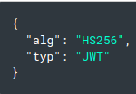

Payload:

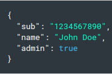

Signature:

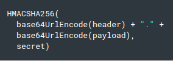

The full JWT should look like:

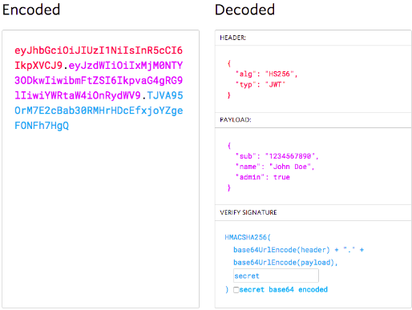

## Deploy a project
- How to?

- Examples of hosting

## Microservices

Instead of containing everything in a single unit, the microservices-based application is broken down into smaller, lightweight pieces based on a logical construct. The application consists of independent small (micro-) services, and when we deploy or scale the app, individual services get distributed within a set of machines which we call “a cluster” in the service fabric world.

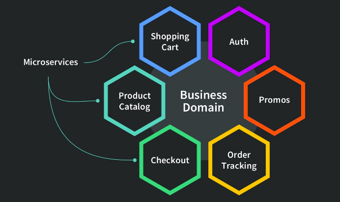

**ADVANTAGES**

* Allows us to build, operate and manage services independently, and we can easily scale them out based on the resources they need.

* Microservices take a lot of infrastructure risk out of the project straight away. With the infrastructure made almost invisible, microservice teams can iterate quickly.

**DRAWBACKS**

* Microservices are not automatically the right solution for every project. When you are running multiple instances of the same service or worker, you don’t necessarily need microservices. A well-built monolithic system can scale just as well for some classes of problems.

* One of the big problems with microservices is “orchestration”, which means how to integrate the services with a guide to drive the process, much like a conductor in an orchestra. Integrating microservices can be quite complex.

## Regular expressions

A regular expression is a sequence of characters that forms a search pattern.

When you search for data in a text, you can use this search pattern to describe what you are searching for.

A regular expression can be a single character, or a more complicated pattern.

Regular expressions can be used to perform all types of text search and text replace operations.


## Minification

Minification is the process of removing unnecessary elements and rewriting code to reduce file size. It is commonly done to web page resources, such as HTML, CSS, and JavaScript files. Reducing the size of web resources allows the files to be transferred more quickly, making web pages load faster.

<ins>Ways to minifiy code:</ins>

https://javascript-minifier.com/

## Ternary operator

The condition is what you’re actually testing. The result of your condition should be true or false or at least coerce to either boolean value.

* A ? separates our conditional from our true value.

* Anything between the ? and the : is what is executed if the condition evaluates to true.

* Finally a : colon. If your condition evaluates to false, any code after the colon is executed.

variablename = (condition) ? value1:value2

<ins>**EXAMPLE**</ins>

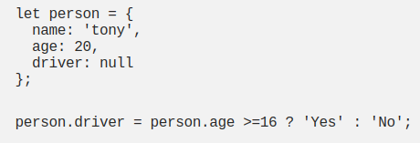

## Recursion

It’s the process in which a function repeatedly calls itself until a condition is met that makes it stop. It is similar to iteration with the main difference being that in recursion the function calls itself to execute instructions, but in iteration there is a loop that repeatedly executes a set of instructions.

<ins>**EXAMPLE**</ins>

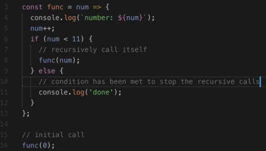

## Logical operators

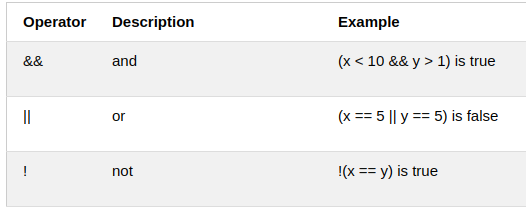

## Spread operator (...)

Basically, there are three places you can use spread: 

1. In function calls
2. In array literals
3. In object literals

<ins>In functions:</ins>

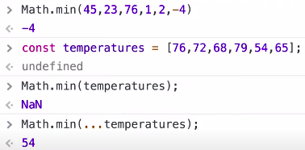

<ins>In arrays:</ins>

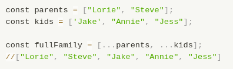

<ins>In objects:</ins>

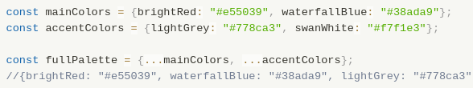

# Version control system

The code which is stored in Git keeps changing as more code is added. Also, many developers can add code in parallel. So Version Control System helps in handling this by maintaining a history of what changes have happened. Also, Git provides features like branches and merges, which I will be covering later.

## GIT

- git --version
- git init
- git add
- git push
- git log
- git pull
- git status
git commit -m ""


## GitHub

We’ve established that Git is a version control system, similar but better than the many alternatives available. So, what makes GitHub so special? Git is a command-line tool, but the center around which all things involving Git revolve is the hub—GitHub.com—where developers store their projects and network with like minded people.

## GitFlow

It's a branching model for GIT. it is very suitable for development teams

<ins>Key Benefits</ins>

Parallel Development
One of the great things about GitFlow is that it makes parallel development very easy, by isolating new development from finished work. New development (such as features and non-emergency bug fixes) is done in feature branches, and is only merged back into main body of code when the developer(s) is happy that the code is ready for release.


<ins>Collaboration</ins>

Feature branches also make it easier for two or more developers to collaborate on the same feature, because each feature branch is a sandbox where the only changes are the changes necessary to get the new feature working. That makes it very easy to see and follow what each collaborator is doing.

<ins>Release Staging Area</ins>

As new development is completed, it gets merged back into the develop branch, which is a staging area for all completed features that haven’t yet been released. So when the next release is branched off of develop, it will automatically contain all of the new stuff that has been finished.

<ins>Support For Emergency Fixes</ins>

GitFlow supports hotfix branches - branches made from a tagged release. You can use these to make an emergency change, safe in the knowledge that the hotfix will only contain your emergency fix. There’s no risk that you’ll accidentally merge in new development at the same time.
  
# POO Basics

## Garbage collector

In the low-level languages like C, developers need to manually allocate and deallocate the memory using the malloc(), calloc(), realloc(), and free() methods. In the high-level languages like Java and JavaScript, we don't need to explicitly allocate or release memory. JavaScript values are allocated when things are created (objects, Strings, etc.) and freed automatically when they are no longer used. This process is called Garbage collection.


## Constructor/destructor

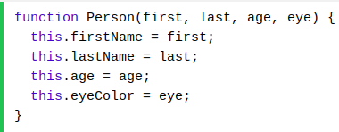

## Encapsulation

Encapsulation is the bundling of data and the methods that act on that data such that access to that data is restricted from outside the bundle, or as Alan Kay describes it, “local retention and protection and hiding of state-process.” In OOP, that means that an object stores its state privately, and only the object’s methods have access to change it.

## Abstraction

An abstraction is a way of hiding the implementation details and showing only the functionality to the users. In other words, it ignores the irrelevant details and shows only the required one.

<ins>Points to remember</ins>

- We cannot create an instance of Abstract Class.
- It reduces the duplication of code

# Markdown

Markdown is a plain text formatting syntax aimed at making writing for the internet easier. The philosophy behind Markdown is that plain text documents should be readable without tags mussing everything up, but there should still be ways to add text modifiers like lists, bold, italics, etc. It is an alternative to WYSIWYG (what you see is what you get) editors, which use rich text that later gets converted to proper HTML.

How to use it -> https://guides.github.com/features/mastering-markdown/

# Agile methodologies

## KANBAN

In general, Kanban is a scheduling system for lean and other JIT processes. In a Kanban process, there are physical (or virtual) “cards” called Kanban that move through the process from start to finish. The aim is to keep a constant flow of Kanban so that as inventory is required at the end of the process, just that much is created at the start.

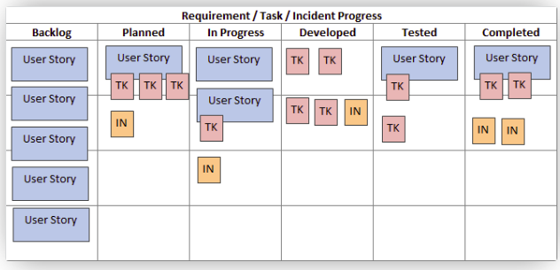

Kanban is an agile methodology that is not necessarily iterative. Processes like Scrum have short iterations which mimic a project lifecycle on a small scale, having a distinct beginning and end for each iteration. Kanban allows the software be developed in one large development cycle. Despite this, Kanban is an example of an agile methodology because it fulfils all twelve of the principles behind the Agile manifesto, because whilst it is not iterative, it is incremental.

## SCRUM

Scrum is an agile development methodology used in the development of Software based on an iterative and incremental processes.  Scrum is adaptable, fast, flexible and effective agile framework that is designed to deliver value to the customer throughout the development of the project. The primary objective of Scrum is to satisfy the customer’s need through an environment of transparency in communication, collective responsibility and continuous progress.

<ins>Benefits of SCRUM</ins>

- Easily scalable
- Flexible to changes
- Higher software quality

## Events in SCRUM

- Sprint: Sprint is the basic unit of work for a Scrum team. This is the main feature that marks the difference between Scrum and other models for agile development.

- Sprint Planning: The goal of the Sprint Planning is to define what is going to be done in the Sprint and how it is going to be done. This meeting is held at the beginning of each Sprint and is defined how it will approach the project coming from the Product Backlog stages and deadlines. Each Sprint is composed of different features.

- Daily Scrum: The objective of the Daily Scrum is to evaluate the progress and trend until the end of the Sprint, synchronizing the activities and creating a plan for the next 24 hours.

- Sprint Review: The goal of the sprint review is to show what work has been completed with regards to the product backlog for future deliveries. The finished sprint is reviewed, and there should already be a clear and tangible advancement in the product to present to the client.

- Sprint Retrospective: The team reviews the completed goals of the finished sprint, write down the good and the bad, so as not to repeat the mistakes again.

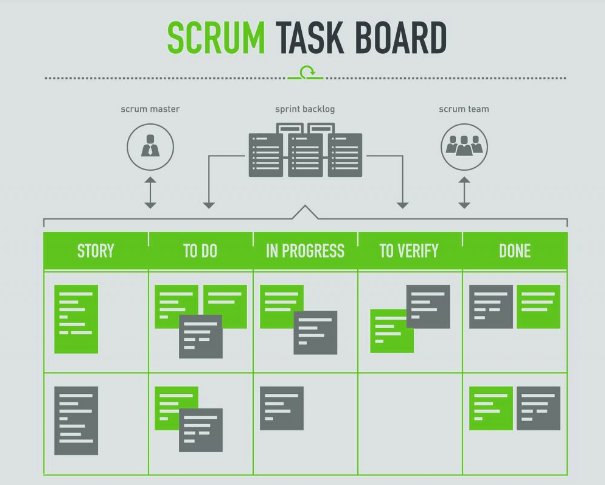


# Best practices

## Design patterns

A design pattern is a term used in software engineering for a general, reusable solution to a commonly occurring problem in software design.

There are many design patterns that we can use to solve our most common problems, but that doesn't means that they are finished solutions, they just give us the tools to fix the problem.

Patterns with examples here:

https://medium.com/better-programming/javascript-design-patterns-25f0faaaa15

## Testing
- What is it?
>
- Basic commands
> 
- Examples
> 

### Jest
- What is it?
>
- Basic commands
> 
- Examples
> 

## S.O.L.I.D

SOLID stands for:

S - Single-responsiblity Principle

O - Open-closed Principle

L - Liskov Substitution Principle

I - Interface Segregation Principle

D - Dependency Inversion Principle


<ins>Single responsibility Principle</ins>

A class should have one and only one reason to change, meaning that a class should have only one job.

<ins>Open-closed Principle </ins>

Objects or entities should be open for extension but closed for modification.

<ins>Liskov substitution Principle</ins>

Let q(x) be a property provable about objects of x of type T. Then q(y) should be provable for objects y of type S where S is a subtype of T.

This means that every subclass or derived class should be substitutable for their base or parent class.

<ins>Interface segregation Principle</ins>

A client should never be forced to implement an interface that it doesn’t use, or clients shouldn’t be forced to depend on methods they do not use.

<ins>Dependency Inversion Principle</ins>

Entities must depend on abstractions, not on concretions. It states that the high-level module must not depend on the low-level module, but they should depend on abstractions.

Detailed info -> https://www.digitalocean.com/community/conceptual_articles/s-o-l-i-d-the-first-five-principles-of-object-oriented-design

#

## D.R.Y

**Don't repeat yourself**

t usually means refactoring code by taking something done several times and turning it into a loop or a function. DRY code is easy to change, because you only have to make any change in one place.

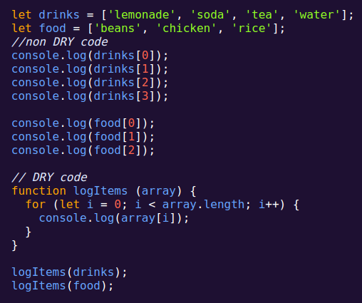

## K.I.S.S

**Keep it simple, Stupid**

It's all about using the simplest code you can.

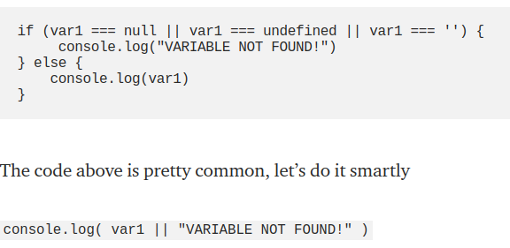

More examples -> https://medium.com/infancyit/kiss-keep-it-simple-smart-javascript-habits-b019ce14b5ec

## Codeparing
- What is it?
>

## Linter 

is a tool that analyzes source code to flag programming errors, bugs, stylistic errors, and suspicious constructs.

Linters have evolved. They started with those simple checks, but nowadays, they are getting more and more sophisticated. They perform Static Analysis, enforce configuration flags, check for compliance with a given style-guide or security rule, and a lot more.

How to set ESLint -> https://sourcelevel.io/blog/how-to-setup-eslint-and-prettier-on-node

- Examples
    - ESLint

## Documentation 

### JSDoc 

SDoc is a documentation generator that is used for the Javascript language, we can compare it with Javadoc (JAVA) or PHPDocumentor (PHP) among others, JSDoc what it does is analyze all the Javascript code and AUTOMATICALLY 🤯 generates a static page (HTML) with All the documentation. JSDoc is easy to integrate with any IDE or Code Editor.

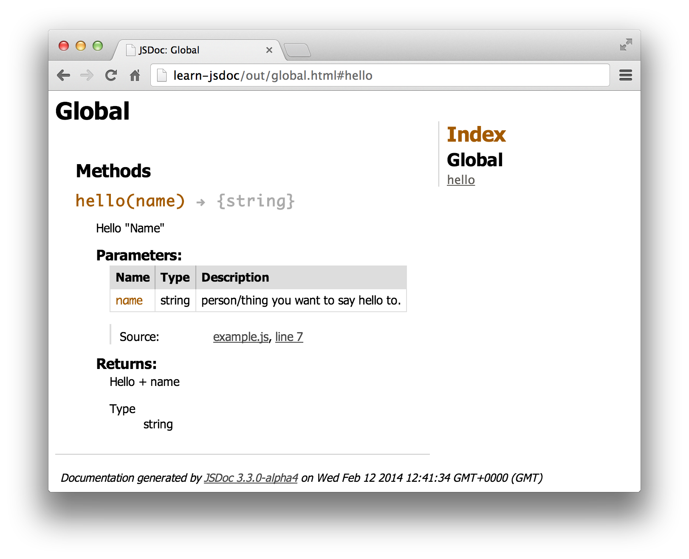

### PlantUML

PlantUML is an open-source tool allowing users to create UML diagrams from a plain text language. 

<ins>Commands:</ins>

- Header
- Footer
- Scale
- Title
- Caption


### Swagger

Swagger allows you to describe the structure of your APIs so that machines can read them. The ability of APIs to describe their own structure is the root of all awesomeness in Swagger. Why is it so great? Well, by reading your API’s structure, we can automatically build beautiful and interactive API documentation. We can also automatically generate client libraries for your API in many languages and explore other possibilities like automated testing. Swagger does this by asking your API to return a YAML or JSON that contains a detailed description of your entire API. 

# Useful technologies
## Contentful

The Content Delivery API (CDA), available at cdn.contentful.com, is a read-only API for delivering content from Contentful to apps, websites and other media. Content is delivered as JSON data, and images, videos and other media as files.

## Express

Express 3.x is a light-weight web application framework to help organize your web application into an MVC architecture on the server side.

You can then use a database like MongoDB with Mongoose (for modeling) to provide a backend for your Node.js application. Express.js basically helps you manage everything, from routes, to handling requests and views.

try to write a small REST API server in plain Node.js (that is, using only core modules) and then in Express.js. The latter will take you 5-10x less time and lines of code.

## Koa

Koa is a new web framework designed by the team behind Express, which aims to be a smaller, more expressive, and more robust foundation for web applications and APIs. By leveraging async functions, Koa allows you to ditch callbacks and greatly increase error-handling. Koa does not bundle any middleware within its core, and it provides an elegant suite of methods that make writing servers fast and enjoyable.

## React

Is a javascript library to build user interfaces

Design simple views for each state in your application, and React will efficiently update and render just the right components when your data changes.

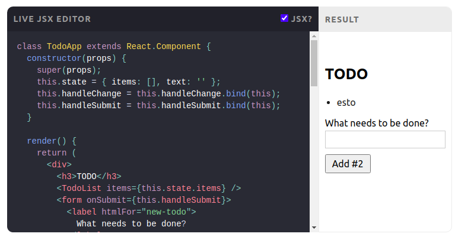

## Redux

Redux is a predictable state container for JavaScript apps.

It helps you write applications that behave consistently, run in different environments (client, server, and native), and are easy to test.

You can use Redux together with React, or with any other view library. It is tiny (2kB, including dependencies), but has a large ecosystem of addons available.
   
## Vue.js

Vue is a progressive framework for building user interfaces. Unlike other monolithic frameworks, Vue is designed from the ground up to be incrementally adoptable. The core library is focused on the view layer only, and is easy to pick up and integrate with other libraries or existing projects. 

## Serverless

It’s a movement driven by developers and businesses who realize that software is eating the world, but you will be eaten too if you build & maintain all of it yourself. It’s a movement that demands that the most menial parts of building an application be abstracted away so that developers are free to actually spend their time delivering business value.

### AWS Lambda

AWS Lambda is a compute service that lets you run code without provisioning or managing servers. Lambda runs your code only when needed and scales automatically, from a few requests per day to thousands per second. You pay only for the compute time that you consume—there is no charge when your code is not running. With Lambda, you can run code for virtually any type of application or backend service, all with zero administration.

**Example:**

The best example is Netflix with its 70 billion hours of content in a quarter to nearly 60 million customer uses AWS Lambda examples of media transform to facilitate their media files in more than 50 formats.

https://www.simform.com/serverless-aws-lambda-examples/#:~:text=Another%20example%2C%20you%20can%20use,trigger%20which%20will%20notify%20SNS.

# Databases
## Relational DB

SQL is short for Structured Query Language, basically meaning a very firm way of sorting through data in the form of tables, columns, and rows. How is data structured in an SQL database? The table itself would be made up really of one variable or object that we would be looking through. The column would represent the data point itself that needs to be stored and the row is a record of the data points per column.

For example, if you are looking to sort data regarding what the weather is at a certain time of the day during a certain day, it would be structured as the following:

Table: Weather
Columns: Days of the Week
Rows: Time of Day
Data Points: Degrees Fahrenheit


## Non relational DB

In contrast to a relational database, a NoSQL database is one that is less structured/confined in format, and thus, allows for more flexibility and adaptability. If you are going to be dealing with a dataset that isn’t clearly defined, meaning not organized or structured, you likely won’t have the luxury of establishing defined tables and relationships amongst the dataset.

### Pros

- The database is highly flexible
- It can be distributed amongst multiple databases
- It is really fast and great for scalability
- Is easy to set up and implement

### Cons

- The database takes up a ton of memory
- It has a document size limit of 16 MB
- It has limitations of nesting to 100 levels
- There is a limit of 20,000 to your max connection number

## C.R.U.D operations

Within computer programming, the acronym CRUD stands for create, read, update and delete. These are the four basic functions of persistent storage. Also, each letter in the acronym can refer to all functions executed in relational database applications and mapped to a standard HTTP method, SQL statement or DDS operation.

## CouchDB

CouchDB uses multiple formats and protocols to store, transfer, and process its data, it uses JSON to store data, JavaScript as its query language using MapReduce, and HTTP for an API. 

## Redis

Redis is an open source (BSD licensed), in-memory data structure store, used as a database, cache and message broker.
It supports various data structures such as Strings, Hashes, Lists, Sets etc.

### <ins> Why should we use it? </ins>

- It's a non-SQL Database
- It's super fast
- Currently, it is being used by tech-giants like GitHub, Weibo, Pinterest, Snapchat, Craigslist, Digg, StackOverflow, Flickr.

# Node JS / JS Theory
          
## V8 engine

V8 is Google’s open source high-performance JavaScript and WebAssembly engine, written in C++. It is used in Chrome and in Node.js, among others. It implements ECMAScript and WebAssembly.

V8 was first designed to increase the performance of JavaScript execution inside web browsers. In order to obtain speed, V8 translates JavaScript code into more efficient machine code instead of using an interpreter.

## Event loop

The event loop is what allows Node.js to perform non-blocking I/O operations — despite the fact that JavaScript is single-threaded — by offloading operations to the system kernel whenever possible.

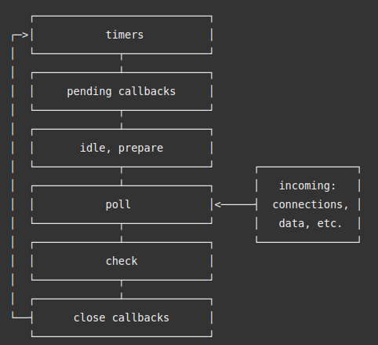

## Modules, require, import/export

Node modules allow you to write reusable code. You can nest them one inside another. Using the Node Package Manager (NPM), you can publish your modules and make them available to the community. Also, NPM enables you to reuse modules created by other developers.

### Require:

require are used to consume modules. It allows you to include modules in your programs. You can add built-in core Node.js modules, community-based modules (node_modules), and local modules.

Let’s say we want to read a file from the filesystem. Node has a core module called ‘fs’:

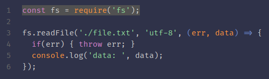

As you can see, we imported the “fs” module into our code. It allows us to use any function attached to it, like “readFile” and many others.

The require function will look for files in the following order:

1. <ins>Built-in core Node.js modules (like fs)</ins>

Some of the most used core modules are:

- fs: Allows you to manipulate (create/read/write) files and directories.
- path: utilities to work with files and directories paths.
- http: create HTTP servers and clients for web development.
- url: utilities for parsing URLs and extracting elements from it.


2. <ins>NPM Modules</ins>. It will look in the node_modules folder.

- lodash: a collection of utility functions for manipulating arrays, objects, and strings.
- request: HTTP client simpler to use than the built-in http module.
- express: HTTP server for building websites and API. Again, simpler to use than the built-in http module.

This ones need to be installed first.

3. <ins>Local Modules</ins>. If the module name has a ./, / or ../, it will look for the directory/file in the given path. It matches the file extensions: *.js, *.json, *.mjs, *.cjs, *.wasm and *.node.

### Exports:

The exports keyword gives you the chance to “export” your objects and methods.

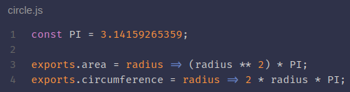

In the code below, we are exporting the area and circumference functions. We defined the PI constant, but this is only accessible within the module. Only the elements associated with exports are available outside the module.

So, we can consume it using require in another file like follows:

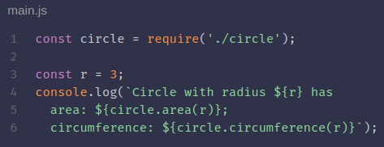

Noticed that this time we prefix the module name with ./. That indicates that the module is a local file.

### Imports:

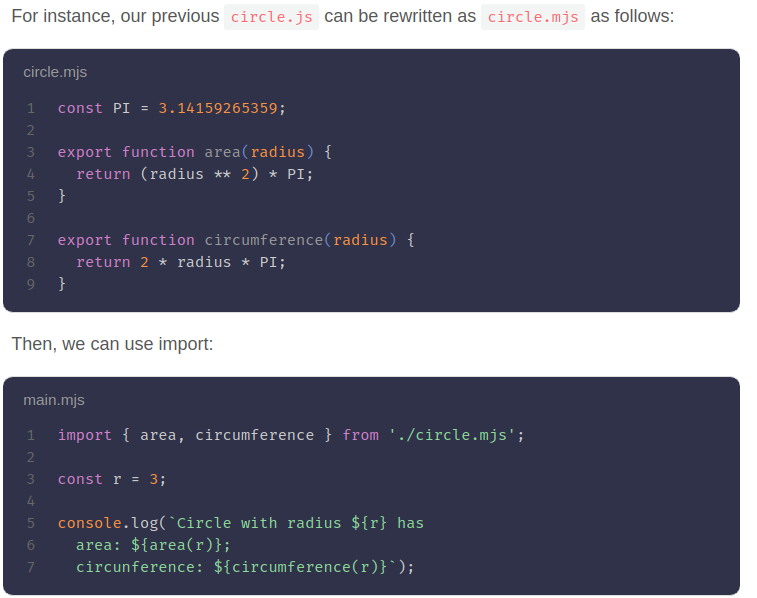

## Node eventemitter

Many objects in a Node emit events, for example, a net.Server emits an event each time a peer connects to it, an fs.readStream emits an event when the file is opened. All objects which emit events are the instances of events.EventEmitter.

### EventEmitter Class
As we have seen in the previous section, EventEmitter class lies in the events module. It is accessible via the following code:

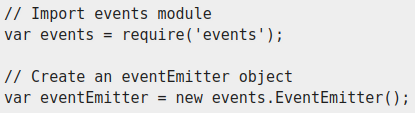

When an EventEmitter instance faces any error, it emits an 'error' event. When a new listener is added, 'newListener' event is fired and when a listener is removed, 'removeListener' event is fired.

EventEmitter provides multiple properties like on and emit. on property is used to bind a function with the event and emit is used to fire an event.

### Example:

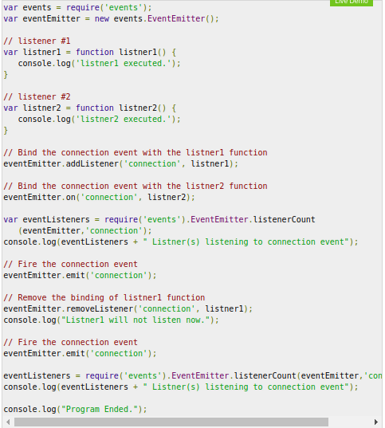

The output of that code should be:

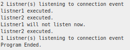

## Streams 

Streams are collections of data, just like arrays or strings. The difference is that streams might not be available all at once, and they don’t have to fit in memory. 

This makes streams really powerful when working with large amounts of data, or data that’s coming from an external source one chunk at a time.

However, streams are not only about working with big data. They also give us the power of composability in our code. Just like we can compose powerful linux commands by piping other smaller Linux commands, we can do exactly the same in Node with streams.

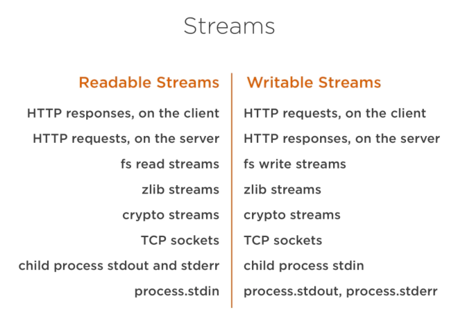

The list above has some examples for native Node.js objects that are also readable and writable streams. Some of these objects are both readable and writable streams, like TCP sockets, zlib and crypto streams.

### Example of stream:

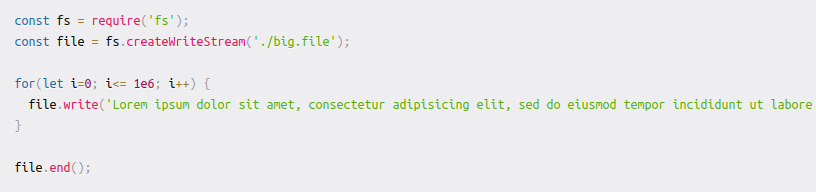

The fs module can be used to read from and write to files using a stream interface. In the example above, we’re writing to that big.file through a writable stream 1 million lines with a loop.

Running the script above generates a file that’s about ~400 MB.

Here’s a simple Node web server designed to exclusively serve the big.file:


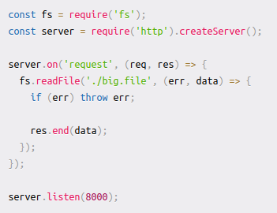

When I ran the server, it started out with a normal amount of memory, 8.7 MB

When i connected to the server, the memory usage jumped to 400mb

We basically put the whole big.file content in memory before we wrote it out to the response object. This is very inefficient.

The HTTP response object (res in the code above) is also a writable stream. This means if we have a readable stream that represents the content of big.file, we can just pipe those two on each other and achieve mostly the same result without consuming ~400 MB of memory.

Node’s fs module can give us a readable stream for any file using the createReadStream method. We can pipe that to the response object:

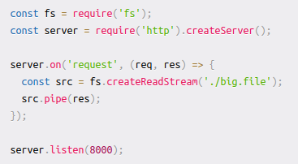

When a client asks for that big file, we stream it one chunk at a time, which means we don’t buffer it in memory at all. The memory usage grew by about 25 MB and that’s it.

Now imagine the same thing but with huge files.

## Buffers

It represents a fixed-size chunk of memory (can’t be resized) allocated outside of the V8 JavaScript engine.

Buffers were introduced to help developers deal with binary data, in an ecosystem that traditionally only dealt with strings rather than binaries.

## JS Data types

##  Error handling

First of all, it is necessary to have a clear understanding of errors in Node.js. In general, Node.js errors are divided into two distinct categories: operational errors and programmer errors.

- Operational errors represent runtime problems whose results are expected and should be dealt with in a proper way. Operational errors don’t mean the application itself has bugs, but developers need to handle them thoughtfully. Examples of operational errors include “out of memory,” “an invalid input for an API endpoint,” and so on.

- Programmer errors represent unexpected bugs in poorly written code. They mean the code itself has some issues to solve and was coded wrong. A good example is to try to read a property of “undefined.” To fix the issue, the code has to be changed. That is a bug a developer made, not an operational error.

### Example:

Assuming you have some experience with async JavaScript and Node.js, you might have experienced drawbacks when using callbacks for dealing with errors. They force you to check errors all the way down to nested ones, causing notorious “callback hell” issues that make it hard to follow the code flow.

Using promises or async/await is a good replacement for callbacks. The typical code flow of async/await looks like the following:

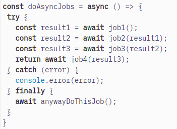

## Callback hell

This is a big issue caused by coding with complex nested callbacks. Here, each and every callback takes an argument that is a result of the previous callbacks. In this manner, The code structure looks like a pyramid, making it difficult to read and maintain. Also, if there is an error in one function, then all other functions get affected.

### How to escape from it:

- JavaScript provides an easy way of escaping from a callback hell. This is done by event queue and promises.

- A promise is a returned object from any asynchronous function, to which callback methods can be added based on the previous function’s result.

- Promises use .then() method to call async callbacks. We can chain as many callbacks as we want and the order is also strictly maintained.

- Promises use .fetch() method to fetch an object from the network. It also uses .catch() method to catch any exception when any block fails.

- So these promises are put in event queue so that they don’t block subsequent JS code. Also once the results are returned, the event queue finishes its operations.

- There are also other helpful keywords and methods like async, wait, settimeout() to simplify and make better use of callbacks.

## Promises

A JavaScript Promise object can be:

- Pending
- Fulfilled
- Rejected

The Promise object supports two properties: state and result.

While a Promise object is "pending" (working), the result is undefined.

When a Promise object is "fulfilled", the result is a value.

When a Promise object is "rejected", the result is an error object.


### Example:

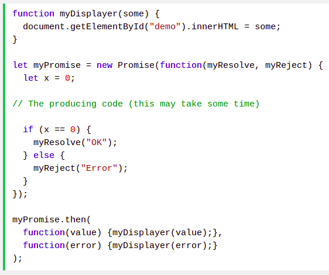

## Async await

Async functions are a combination of promises and generators, and basically, they are a higher level abstraction over promises. Let me repeat: async/await is built on promises.

### Explanation:

An async function returns a promise, like in this example:

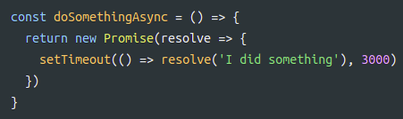

When you want to call this function you prepend await, and the calling code will stop until the promise is resolved or rejected. One caveat: the client function must be defined as async. Here's an example:

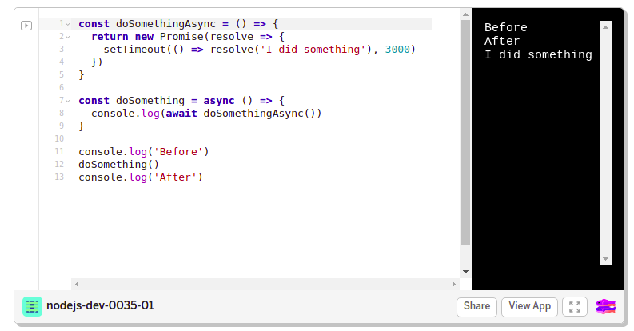

## HOF

### Arrow function

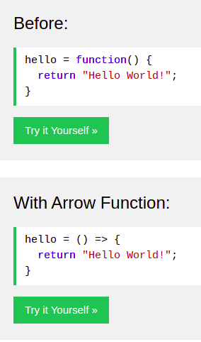

### .map

The map() method creates a new array with the results of calling a function for every array element.

The map() method calls the provided function once for each element in an array, in order.

Note: map() does not execute the function for array elements without values.

### Example:

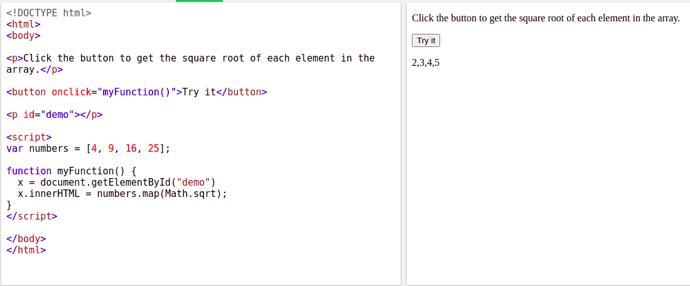

### .reduce

- The reduce() method reduces the array to a single value.

- The reduce() method executes a provided function for each value of the array (from left-to-right).

- The return value of the function is stored in an accumulator (result/total).

- Note: reduce() does not execute the function for array elements without values.

- Note: This method does not change the original array.

### Example: 

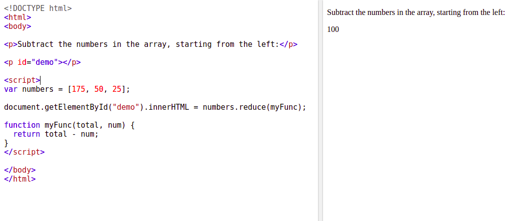

# Object methods

## this

In a function definition, this refers to the "owner" of the function.

In the example above, this is the person object that "owns" the fullName function.

In other words, this.firstName means the firstName property of this object.

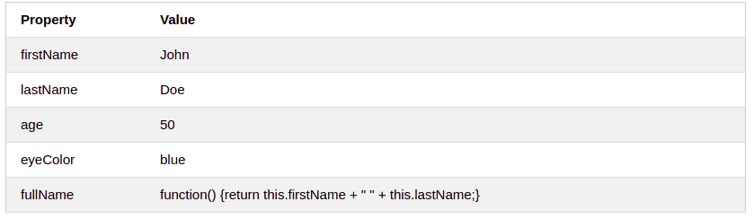

## keys
- What is it?
>
- Implementation
> 
- Examples
> 

## etc...

# Array methods

## .push

The push() method adds new items to the end of an array, and returns the new length.

- Note: The new item(s) will be added at the end of the array.

- Note: This method changes the length of the array.

- Tip: To add items at the beginning of an array, use the unshift() method.

## .pop

- The pop() method removes the last element of an array, and returns that element.

- Note: This method changes the length of an array.

- Tip: To remove the first element of an array, use the shift() method.


## etc...

# JSON Methods

## stringify 

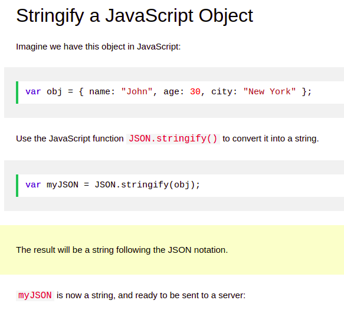

## parse

A common use of JSON is to exchange data to/from a web server.

When receiving data from a web server, the data is always a string.

Parse the data with JSON.parse(), and the data becomes a JavaScript object.

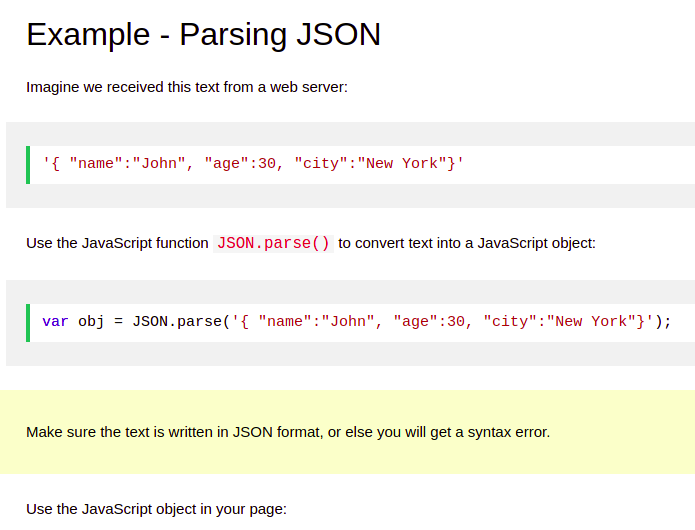

# SCOPE
## var

The var statement declares a variable.

Variables are containers for storing information.

Creating a variable in JavaScript is called "declaring" a variable:

var carName;
After the declaration, the variable is empty (it has no value).

To assign a value to the variable, use the equal sign:

carName = "Volvo";

You can also assign a value to the variable when you declare it:

var carName = "Volvo";

## let

Main difference is scoping rules.

Variables declared by var keyword are scoped to the immediate function body (hence the function scope) while let variables are scoped to the immediate enclosing block denoted by { } (hence the block scope).

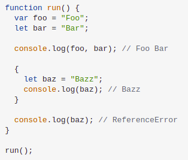

## const

Variables defined with const behave like let variables, except they cannot be reassigned:

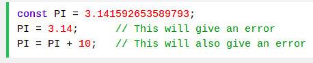

# Ecmascript

JavaScript is a subset of ECMAScript.

JavaScript is basically ECMAScript at its core but builds upon it. Languages such as ActionScript, JavaScript, JScript all use ECMAScript as its core.

As a comparison, AS/JS/JScript are 3 different cars, but they all use the same engine... each of their exteriors is different though, and there have been several modifications done to each to make it unique.

# Prototype

All JavaScript objects inherit properties and methods from a prototype.

All JavaScript objects inherit properties and methods from a prototype:

- Date objects inherit from Date.prototype

- Array objects inherit from Array.prototype

- Person objects inherit from Person.prototype

The Object.prototype is on the top of the prototype inheritance chain:

Date objects, Array objects, and Person objects inherit from Object.prototype.


# END OF README FILE

# Bibliography
```
https://javascript.info/
https://eloquentjavascript.net/
https://github.com/getify/You-Dont-Know-JS/blob/2nd-ed/get-started/README.md
https://github.com/bevacqua/es6
https://jgthms.com/javascript-in-14-minutes/
https://learnxinyminutes.com/docs/javascript/
https://hackernoon.com/restful-api-designing-guidelines-the-best-practices-60e1d954e7c9 

https://undraw.co/ (SVG Ilustration)
https://pages.github.com/
https://www.markdownguide.org/cheat-sheet/
```
